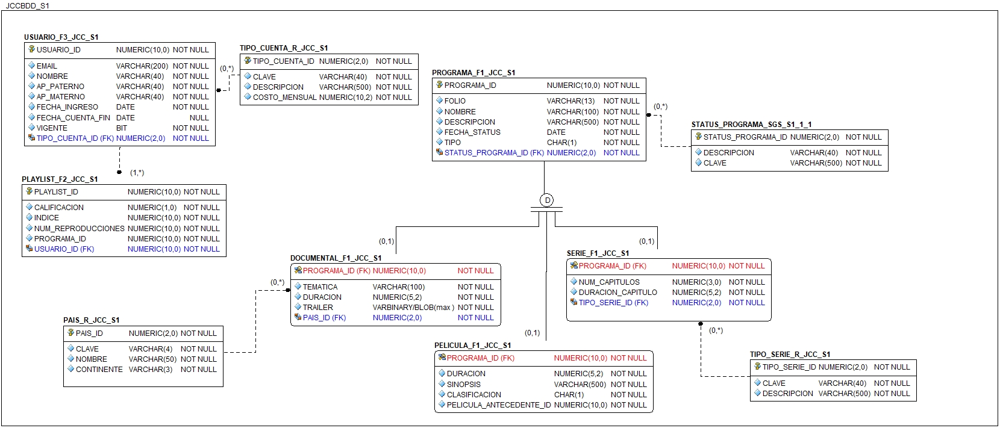
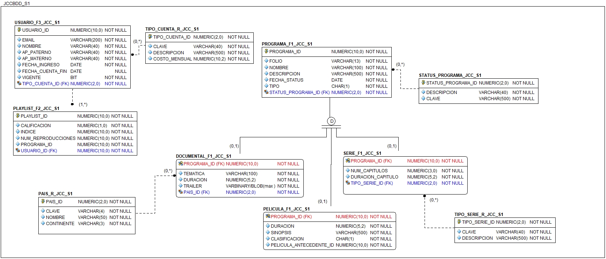

# NetMax

## Nodos de distribución

|Núm nodo | Características | Nombre Global del PDB | Sufijo para fragmentos
|--|--|--|--|
| 1 | <ul><li>Servidor con capacidad de procesamiento y memoria limitados. </li></ul>| jccbdd_s1.fi.unam | JCC_S1 |
| 2 | <ul><li>Servidor con grandes capacidades de procesamiento, memoria y alta disponibilidad. </li></ul>| jccbdd_s1.fi.unam | JCC_S2 |
| 3 | <ul><li>Servidor con software especializado para editar videos enfocados al aprendizaje y a la educación. </li><li>Su capacidad de procesamiento y memoria se considera como medio</li><li>Cuenta con licencias y herramientas de seguridad que permiten cifrar y proteger datos delicados o sensibles.</li></ul>| sgsbdd_s1.fi.unam | SGS_S1 |
| 4 | <ul><li>Servidor con gran capacidad de almacenamiento, en especial para realizar el tratamiento de datos estáticos o históricos que ya no sufren actualizaciones.</li></ul>| sgsbdd_s2.fi.unam | SGS_S2 |

## Esquema de Fragmentación

## Diagrama relacional original (sin fragmentos)

## Diagrama relacional con fragmentos

## Diagramas relacionales por nodo

### Diagrama de JCCBDD_S1

### Diagrama de JCCBDD_S2

### Diagrama de SGSBDD_S1

### Diagrama de SGSBDD_S2

## RESTRICCIONES DE INTEGRIDAD QUE SE CONSERVAN

| SITIO | Nombre del fragmento/Tabla Padre | Nombre del fragmento/Tabla Hijo |
|:--:|:--:|:--:|
| JCCBDD_S1   |  USUARIO_F3_JCC_S1      |   PLAYLIST_F2_JCC_S1   |
| JCCBDD_S1   |  TIPO_CUENTA_R_JCC_S1   |   USUARIO_F3_JCC_S1    |
| JCCBDD_S1   |  STATUS_PROGRAMA | PROGRAMA_F1_JCC_S1  |
| JCCBDD_S1   |  PAIS_R_JCC_S1          | DOCUMENTAL_F1_JCC_S1 |   
| JCCBDD_S1   | TIPO_SERIE_R_JCC_S1     | SERIE_F1_JCC_S1 |
| JCCBDD_S2   |  USUARIO_F5_JCC_S2      |   PLAYLIST_F4_JCC_S2   |
| JCCBDD_S2   |  TIPO_CUENTA_R_JCC_S2   |   USUARIO_F5_JCC_S2   |
| SGSBDD_S1   |  USUARIO_F4_SGS_S1      |   PLAYLIST_F3_SGS_S1   |
| SGSBDD_S1   |  TIPO_CUENTA_R_SGS_S1   |   USUARIO_F4_SGS_S1    |
| SGSBDD_S1   |  STATUS_PROGRAMA        | PROGRAMA_F2_SGS_S1  |
| SGSBDD_S1   |  PAIS_R_SGS_S1          | DOCUMENTAL_F2_SGS_S1 |   
| SGSBDD_S1   | TIPO_SERIE_R_SGS_S1     | SERIE_F2_SGS_S1 |
| SGSBDD_S2   |  USUARIO_F2_SGS_S2      |   PLAYLIST_F1_SGS_S2   |
| SGSBDD_S2   |  TIPO_CUENTA_R_SGS_S2   |   USUARIO_F2_SGS_S2    |
| SGSBDD_S2   |  STATUS_PROGRAMA        | PROGRAMA_F3_SGS_S2  |
| SGSBDD_S2   |  PAIS_R_SGS_S2          | DOCUMENTAL_F3_SGS_S2 |   
| SGSBDD_S2   | TIPO_SERIE_R_SGS_S2     | SERIE_F3_SGS_S2 |

#### TOTAL DE FKS: 17 (SIN DISJOINTS)

#### TOTAL DE FKS:26 (CON DISJOINTS)